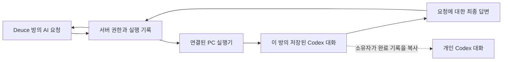

# 방별 Codex 대화 유지와 개인 이어가기 구현 계획

작성·공식 문서 확인: 2026-09-08. 상태: **계획 초안 / 구현 전**.
코드 조사 기준: `da3d0e6`, 로컬 CLI: `codex-cli 0.153.4`.

## 1. 목적과 이번 범위

감독 요구는 채널에 초대한 AI가 어느 Codex 대화에 연결되는지 알고,
Deuce에서 진행한 AI 대화를 Codex에서도 이어가는 것이다.
첫 구현 범위는 **방마다 Codex 대화를 유지하고, 연결한 PC에서 그 기록을 이어 여는 기능**이다.

| 사용자 동작 | 계획하는 결과 |
|---|---|
| 같은 방에서 AI에게 다시 요청 | 그 방·그 AI의 이전 실행 기록을 이어 사용 |
| Deuce 앱을 종료했다가 같은 계정으로 재실행 | 로컬 기록과 서버 연결이 유효하면 같은 대화를 복구 |
| 소유자가 `Codex CLI에서 이어하기` 선택 | 완료된 방 대화를 복사한 개인 Codex 대화를 열기 |
| 다른 방에서 같은 AI에게 요청 | 별도 대화를 사용 |
| `새 AI 대화 시작` 선택 | 기존 채팅은 두고 AI가 사용하는 대화만 새로 시작 |

**개인 이어가기는 `fork`를 사용하는 제안이다.** 방에서는 원래 대화를 계속 사용하고,
개인 복사본의 추가 질문·답변은 Deuce로 자동 게시하지 않는다.
동일한 대화 ID를 양쪽에서 함께 사용하는 기능은 후속 범위로 구분한다.
기존에 열어 둔 이 Codex 대화에 다른 기록을 합치거나, 현재 화면을 원격 조종하는 기능도 포함하지 않는다.

첫 제공자는 Codex다. Claude의 현재 실행과 기존 MCP 읽기·검색·게시 계약은 유지한다.
개인 복사본에 과거 방 자료가 포함된다는 점을 이어가기 화면에 표시한다.

## 2. 현재 구현에서 확인한 사실

| 코드 | 현재 동작과 변경이 필요한 이유 |
|---|---|
| [실행기](../../packages/agent-runner/src/index.ts) | 매 요청 `codex exec --ephemeral`; 실행마다 임시 작업 폴더를 만들고 제거한다. 대화 ID 저장·재개가 없다. |
| [서버 실행](../../apps/server/src/realtime/agent-runtime.ts) | 최근 메시지 50개와 작은 텍스트 첨부를 매번 전달한다. 요청과 답변의 권한을 검사한다. |
| [실행 기록](../../apps/server/prisma/schema.prisma) | `AgentRun`은 요청·결과 기록이다. 여러 요청을 묶는 Codex 대화는 표현하지 않는다. |
| [실행 요청 API](../../apps/server/src/routes/agent-runs.ts) | 같은 요청 ID 재사용을 검사하고 AI당 동시 실행을 제한한다. |
| [PC 연결](../../apps/desktop/src/agents.ts) | 원점·소유자별 연결 키를 암호화해 복구한다. 대화 ID와 지속 작업 폴더는 없다. |
| [채팅 UI](../../apps/web/src/components/AgentInvite.tsx) | 응답 가능·답변 중·오프라인 표시와 요청만 제공한다. |

DB에는 이미 AI당 `RUNNING` 기록을 하나로 제한하는 부분 고유 인덱스가 있다.
Execa는 CLI 실행·취소·하위 프로세스 종료, Socket.IO는 전송, TanStack Query는 UI 상태를 담당한다.
이 구성과 [ADR 012](../adr/012-invite-and-run-personal-ai.md)의 권한·중복 방지 계약을 재사용한다.

## 3. 공식 자료와 판단

아래의 기능 존재와 이번 제품에 채택한다는 판단을 구분한다.

| 공식 자료 | 확인한 내용 | 이 계획에 적용하는 판단 |
|---|---|---|
| [비대화형 실행](https://learn.chatgpt.com/docs/non-interactive-mode) | `--ephemeral`은 기록 저장을 생략한다. JSONL의 `thread.started`에 대화 ID가 있고 `exec resume <ID>`로 후속 요청을 실행한다. | 기존 실행기를 확장하는 첫 후보. ID를 명시하고 `--last`는 사용하지 않는다. |
| [CLI 명령 참조](https://learn.chatgpt.com/docs/cli/reference) | `resume`과 `fork`를 제공하며 `fork`는 원본 기록을 유지하는 새 대화다. | 방은 resume, 개인 이어가기는 fork. 비대화형 기록의 fork는 아래 실제 실험으로 확인한다. |
| [Codex SDK](https://learn.chatgpt.com/docs/codex-sdk) | TypeScript SDK에 대화 시작·계속 실행·ID 기반 재개가 있다. | SDK도 후보로 비교했다. 현재 CLI·Execa가 있어 신규 런타임 의존성을 바로 추가할 근거는 부족하다. |
| [App Server](https://learn.chatgpt.com/docs/app-server) | 대화 읽기·재개·분기, 턴 실행·취소와 버전별 스키마 생성을 제공한다. WebSocket 전송은 experimental/unsupported로 명시돼 있다. | 대화 목록과 실시간 양방향 연결을 확장할 때 재검토한다. 첫 버전의 원격 공개 전송 기반으로 삼지 않는다. |
| [프로젝트와 대화](https://learn.chatgpt.com/docs/projects) | CLI에서 저장된 대화를 재개할 수 있고 기록된 작업 디렉터리도 유지한다. | 작업 폴더를 요청 종료 시 삭제하는 현재 구조를 바꾼다. |

로컬에서는 `codex --version`, `codex exec resume --help`, `codex resume --help`,
`codex fork --help`, `codex app-server --help`를 읽어 명령 존재를 확인했다.
**모델을 실행한 저장·재개·fork 검증은 아직 수행하지 않았다.**

### 아직 보장하지 않는 항목

- `exec`로 저장한 기록을 이 PC의 `codex fork <ID>`가 실제로 여는지.
- GUI 앱의 특정 대화를 여는 공식 딥링크. 이번에 확인한 자료에서 근거를 찾지 못했다.
- 지금 이 대화를 호스팅하는 앱의 세션을 외부에서 선택·연결할 수 있는지.
- 다른 PC에서 ID만으로 같은 기록을 여는 기능. 첫 버전의 원본 기록은 연결한 PC에 있다.
- 세션이 저장되면 모든 과거 내용을 영구히 정확하게 기억한다는 보장. 모델의 컨텍스트 한계는 유지된다.

## 4. 기술 제안

첫 후보는 **기존 Execa + 공식 CLI의 저장·resume·fork** 조합이다.
대화 기록 형식·압축·재개는 Codex가 관리한다. Deuce는 연결 식별자와 실행 결과만 관리한다.
Codex 내부 DB나 기록 파일을 직접 수정·병합하지 않는다.

### 소유권과 저장

- 서버가 방·에이전트·대화 세대의 유효성을 소유한다. 로컬 PC는 Codex 대화 ID와 작업 폴더를 소유한다.
- 로컬 식별에는 서버 원점, Deuce 소유자, 에이전트, 방, 제공자, 대화 세대를 모두 포함한다.
- 파일명과 명령 인자는 검증한 식별자로 만든다. 방 이름이나 사용자가 입력한 경로를 실행하지 않는다.
- PC 메타데이터는 기존 설정 저장처럼 원자적 교체를 사용한다. Codex 기록을 Deuce 서버로 복제하지 않는다.
- Codex 기록은 CLI가 자체 저장한다. 현재 safeStorage의 연결 키 암호화를 대화 기록 전체의 암호화로 표현하지 않는다.
- 다른 PC·다른 계정·로컬 기록 유실 시 자동으로 다른 기록을 찾지 않는다. 상태를 안내하고 새 대화를 시작한다.

### 서버 데이터와 프로토콜 변경안

물리 스키마는 0단계 실험 후 확정한다. 필요한 논리 계약은 다음과 같다.

| 데이터 | 제안하는 내용 |
|---|---|
| 방별 AI 대화 레코드 | `(agentId, conversationId)` 고유 연결, 세대, 연결 PC 식별자, 마지막 전달 문맥 위치 |
| 실행 기록 | 요청 당시 대화 세대와 문맥 기준점을 기록해 늦은 결과를 검사 |
| 로컬 대화 매핑 | 위 소유권 범위, `threadId`, 지속 작업 폴더, 진행 중·마지막 완료 요청 ID |
| 실행기 기능 협상 | 지속 대화 지원 여부와 프로토콜 버전. 구 실행기는 기존 일회성 실행을 유지 |
| 공개 상태 | 대화 유지 여부·이어가기 가능 여부. 로컬 절대 경로와 CLI 기록 원문은 공개 DTO에 넣지 않음 |

서버 migration은 기존 키·범위·실행 기록을 보존하는 추가 방식으로 한다.
기존 실행기를 지속 대화 지원 실행기로 오인하지 않도록 기능 협상을 먼저 추가한다.

### 대화 진행과 문맥 전달

1. 첫 요청은 현재처럼 최대 최근 50개 대화와 제한된 텍스트 첨부로 시작한다.
2. JSONL의 대화 ID를 로컬 매핑에 기록하고, 이후 같은 범위는 명시한 ID로 재개한다.
3. 후속 요청은 마지막 완료 시점 이후의 새 대화를 전달한다. 질문 자체는 한 번만 제공한다.
4. 문맥 기준점은 메시지의 `(createdAt, id)`로 고정하고 요청 이후의 대화가 섞이는 규칙을 명시한다.
5. 새 메시지가 한 번의 한도를 넘으면 생략 여부를 표시한다. 무제한 조회나 전체 방 이력 제공을 약속하지 않는다.
6. 문맥 위치는 답변 게시와 같은 서버 트랜잭션에서 확정한다. 응답 유실 후 같은 ID는 기존 실행 결과를 조회한다.

### 실패·삭제·접근 해제

- 새 큐를 만들지 않고 기존 AI당 한 실행 규칙을 유지한다. 실행 중 새 요청은 현재처럼 재요청 안내를 제공한다.
- 모델이 기록을 추가했으나 결과 수신·게시 여부가 불명확하면 그 대화를 계속 재개하지 않는다.
  해당 세대를 사용 불가로 기록하고 다음 명시적 요청은 새 세대로 시작한다. 자동 모델 재실행은 없다.
- 앱 재실행 시 미완료 로컬 실행도 같은 규칙으로 처리한다. 정상 완료 기록만 이어 쓴다.
- 방 접근 해제·계정 변경·키 회수 시 실행을 취소하고 이전 세대를 무효화한다.
  해제 중 PC가 꺼져 있었더라도 서버의 세대 검사로 오래된 로컬 매핑을 거부한다.
- 메시지 수정·삭제, 자료 제거처럼 이미 전달한 내용이 바뀌면 문맥 세대를 갱신한다.
  기존 실행의 게시와 개인 이어가기 준비에도 그 세대를 검사한다. 다음 요청은 현재 유효 자료로 새 대화를 만든다.
- 삭제한 내용의 영향을 완전히 제거한다고 주장하지 않는다. 이미 저장된 기록·개인 복사본의 사본 회수는 별도다.
- 단순 새 메시지·반응·읽음 변화는 대화를 초기화하지 않는다.

세대 갱신과 답변 게시의 순서는 기존 AgentConnection 잠금·Prisma 트랜잭션을 확장해 고정한다.
관련 메시지/참여 변경 경로에도 같은 순서의 검사·취소가 필요하므로 실행기만 고쳐 끝내지 않는다.

### 개인 이어가기

- 버튼은 **연결한 PC에서 같은 Deuce 계정의 소유자**에게 제공한다. 다른 참여자는 방에서 AI 요청을 계속 사용한다.
- 개인 이어가기 준비 시 서버 권한과 최신 대화 세대를 다시 확인한다. 네이티브 IPC는 렌더러가 전달한 소유자 주장을 신뢰하지 않는다.
- 완료된 기록을 특정 ID로 fork한다. 개인 복사본 ID를 방의 로컬 매핑에 덮어쓰지 않는다.
- 실행 중에는 준비 완료를 기다리게 한다. 실제 분기가 끝나기 전 새 방 실행과 경합하지 않는 방법을 0단계에서 검증한다.
- UI 명칭은 첫 버전에 맞춰 `Codex CLI에서 이어하기`로 한다. 제공되지 않은 GUI 딥링크는 만들지 않는다.
- 공통 제공 경로는 검증된 이어가기 명령 복사다. Mac/Windows의 터미널 직접 열기는 운영체제별 실기 검증 후 제공한다.
- 개인 복사본에는 fork 시점까지 AI에 전달됐던 방 자료가 들어간다. 이후 새 방 메시지는 자동 동기화하지 않는다.
- 개인 복사본의 도구·작업 폴더·권한은 별도로 안내하고, 해당 설정이 방의 AI 실행에 되돌아오지 않게 한다.

## 5. 구현 순서와 각 단계의 완료 기준

### 0단계 — 실제 CLI 호환성 실험

운영 방 대신 합성 대화와 별도 작업 폴더를 사용한다. 민감한 개인 세션은 탐색하지 않는다.

- 첫 요청에서 식별 문구를 전달하고 다음 프로세스의 `exec resume <ID>`가 이를 이어받는지 확인.
- 실행기를 종료·재시작한 뒤 동일한 ID를 재개하고, 다른 방 ID는 분리되는지 확인.
- 비대화형 기록의 `codex fork <ID>`로 개인 대화를 열어 원본과 새 대화 ID가 다른지 확인.
- fork 중 원본 쓰기와 겹칠 때 동작 및 완료된 기록만 여는 방법을 확인.
- 재개에서도 사용자 설정 미로드·읽기 전용·도구 제한이 유지되는지 확인.
  `exec`와 `exec resume`의 옵션이 다르므로 문자열을 그대로 재사용하지 않는다.
- 손상·없는 기록·실행 중 종료·로그아웃·CLI 버전 차이의 실제 실패 형태를 확인.

**완료 기준:** 저장→재개→재시작→개인 fork가 확인되고 제한 정책이 유지된다.
실험이 실패하면 CLI 경로가 검증됐다고 표시하지 않는다. SDK 또는 App Server stdio를 재평가하고
그 결과를 이 문서에 반영한 뒤 제품 코드를 수정한다.

### 1단계 — 서버 계약과 지속 실행기

- 실행기 테스트로 같은 방의 두 요청이 현재 별도 대화를 만든다는 실패를 먼저 고정한다.
- 소유권 범위·대화 세대·문맥 위치·기능 협상 타입과 추가 migration을 구현한다.
- CLI 기록 저장, 지속 작업 폴더, ID 기반 재개, 원자적 로컬 매핑과 불명확한 실패 처리를 구현한다.
- 서버 중복 방지와 권한 검사, 삭제·수정·해제 시 무효화를 연결한다.

**완료 기준:** 같은 방 재개·다른 방 분리·앱 복구·중복 배제·권한 무효화의 서버/실행기 검증 통과.

### 2단계 — 앱 표시와 개인 이어가기

- `대화 유지 중`, `새 AI 대화 시작`, `Codex CLI에서 이어하기`를 기존 AI 관리에 추가한다.
- 네이티브 소유자/원점 검사 후 준비하고, 완료된 기록의 개인 fork 명령을 제공한다.
- 웹·다른 PC·Claude·구 실행기에는 지원 상태를 구분해 표시한다.
- 채팅 초안, 질문 재전송 ID, 기존 기본 AI 설정을 유지한다.

**완료 기준:** 소유자 PC에서 실제 개인 대화를 이어 열고 원본 방의 다음 답변에 개인 추가 내용이 들어가지 않음.
명령 복사만 검증된 플랫폼에서 터미널 자동 열기까지 완료했다고 표시하지 않는다.

### 3단계 — 통합 검증과 릴리스 준비

- 아래 검증표와 `pnpm test`, `pnpm typecheck`, `pnpm build`를 수행한다.
- 격리 DB에서 기존 데이터가 있는 migration 전·후 결과를 비교한다.
- 두 계정 브라우저, 실제 서명 앱의 저장·재실행, Mac/Windows의 이어가기를 검증한다.
- 확인된 인터페이스를 ADR 012의 후속 ADR로 확정하고 사용법·진행 상태·검증 이관을 갱신한다.
- 서버/구 실행기/신 실행기의 혼합 버전을 확인하고 기능을 끄면 기존 일회성 실행으로 돌아가게 한다.

**완료 기준:** 지원 플랫폼별 증빙과 알려진 한계가 있는 리뷰 가능한 변경.
운영 DB 적용과 앱 공개는 이 계획 작성의 실행 범위에 포함하지 않는다.

## 6. 검증표

| 사례 | 통과 조건 |
|---|---|
| 같은 방의 두 요청 | 두 번째 실행이 같은 Codex 대화를 사용 |
| 같은 AI의 두 방 | 방 사이 식별 문구와 텍스트 첨부가 섞이지 않음 |
| 같은 방의 두 AI·다른 서버의 동명 방 | 소유자·제공자·원점 범위가 섞이지 않음 |
| 정상 완료 후 앱 재시작 | 같은 계정·PC에서 이전 대화를 복구 |
| 생성 직후·모델 실행 중·결과 게시 전 강제 종료 | 불명확한 실행을 자동 재실행하거나 그 기록으로 무조건 이어가지 않음 |
| HTTP 응답 유실과 같은 요청 재전송 | 모델 실행·질문·답변이 중복되지 않음 |
| 삭제/수정 직후 요청 및 기존 답변 도착 | 옛 문맥 세대로 새 응답을 게시하지 않음 |
| 오프라인 동안 해제 후 재초대 | 예전 로컬 대화를 복구하지 않음 |
| 로그아웃·다른 계정 로그인 | 이전 소유자의 복구·이어가기 접근을 거부 |
| 개인 이어가기 후 민감 문구 추가 | 방 원본의 다음 요청이 그 개인 문구를 전달받지 않음 |
| 이어가기 준비와 방 요청의 경합 | 완료된 일관된 기록에서만 분기 |
| 로컬 기록 유실·다른 PC 연결 | 상태를 안내하고 잘못된 세션으로 대체하지 않음 |
| 문맥 상한 초과·오래된 대화 | 제공 범위와 생략 사실을 확인할 수 있음 |
| 구 실행기·Claude·기존 MCP | 기존 응답·접근 범위 유지 |
| Mac/Windows·공백 경로·취소 | 검증한 명령만 실행하고 남는 하위 프로세스 없음 |

## 7. 예상 변경 파일

| 영역 | 파일/디렉터리 |
|---|---|
| 프로토콜·DTO | `packages/shared/src/agent.ts` |
| 저장·재개·fork 준비 | `packages/agent-runner/src/`와 테스트 |
| 서버 연결·문맥·실행 | `apps/server/src/realtime/agent-runtime.ts`, `routes/agent-runs.ts` |
| 권한·기록 무효화 | `routes/agent-management.ts`, 관련 `messages.ts`·`conversations.ts` 경로 |
| 데이터 | `apps/server/prisma/schema.prisma`, 추가 migration, 서버 테스트 |
| PC 연결·IPC | `apps/desktop/src/agents.ts`, `main.ts`, `preload.ts` 및 테스트 |
| 화면·타입 | `apps/web/src/components/AgentInvite.tsx`, `AgentSettings.tsx`, `desktop.d.ts` 및 테스트 |
| 문서 | 후속 ADR, `docs/ai-connections.md`, 진행 상태·변경 이력·검증 이관 |

## 8. 후속 범위와 다음 착수점

현재 진행 중인 Codex 대화를 직접 방에 연결하는 양방향 기능은 별도 단계다.
그때는 호스트 앱의 공식 세션 접근, App Server의 대화 목록과 턴 이벤트,
동시에 들어온 요청의 소유권, 기존 개인 자료와 도구 권한의 공유 정책을 다시 설계한다.
개인 fork 결과를 자동으로 방 원본에 병합하지 않는다.

다음 착수점은 **0단계 합성 대화 실험**이다. 이 계획에서 아직 검증하지 않은 사항을
구현 완료나 공식 지원으로 취급하지 않는다.
