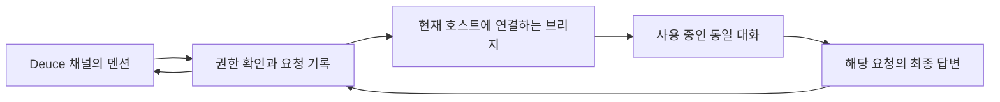

# AI 참여 재설계 계획

작성·수정: 2026-09-11 · 상태: 현재 사용 중인 세션 연결로 목표 확정, 연결 방법 검증 전 · [이슈 #18](../issues/18-reset-ai-feature.md)

## 출발점

감독의 질문은 “지금 이야기하는 AI가 채널에 들어갈 수 있는가”, “다른 사용자는 내 봇과 어떻게 이야기하는가”였다.
기존 초대 구현은 별도 CLI 작업을 실행했으므로 현재 대화 세션을 공유한다는 기대와 달랐다.
우선 기존 AI UI·API·MCP·실행기를 제거하고 사람 채팅을 기준 상태로 삼는다.
과거 AI 답변은 작성자와 함께 읽을 수 있게 보존한다. 제거 배포는 별도 후속 작업이다.

## 확정한 목표

감독: “내가 지금 사용하는 세션을 붙이고 싶거든?”

소유자가 현재 열어 작업하는 **동일한 대화**에 채널 질문이 전달되고, 그 대화가 답한다.
새 실행마다 다른 대화를 만들거나 기존 내용을 복사한 fork를 연결하는 방식은 이 요구의 완료로 인정하지 않는다.
채널에서 한 질문과 답변을 원래 사용하던 앱에서도 이어 볼 수 있어야 한다.
9월 8일의 방별 새 세션·개인 fork 초안은 이 목표를 충족하지 않으므로 구현 기준으로 사용하지 않는다.

현재 세션을 호스팅하는 앱(Codex 앱·Orca·터미널 등)은 확인 중이다. 호스트에 따라 연결 수단이 달라진다.

## 제안하는 사용 흐름

1. 소유자가 현재 대화에서 “이 세션을 Deuce의 ○○ 채널에 연결”을 요청하거나 호스트의 연결 동작을 사용한다.
2. Deuce 계정과 채널 권한을 확인하고 **그 세션에서 연결을 확인**한다. 이름만 같거나 키만 등록됐다는 이유로 연결 완료를 표시하지 않는다.
3. 채널에는 `대욱의 Codex · 연결됨`처럼 소유자와 AI를 표시한다. 상세 화면에서 연결한 대화 제목을 확인한다.
4. 다른 참여자가 `@대욱의 Codex 이 부분 설명해줘`라고 쓰면 작성자·채널·메시지 ID를 포함한 질문이 같은 세션에 도착한다.
5. 세션의 해당 질문에 대한 최종 답변을 원문 질문과 연결해 채널에 게시한다. 원래 앱에서도 그 대화를 이어간다.
6. 소유자가 해제하면 새 전달과 늦은 답변 게시를 차단한다. 세션 자체와 이미 게시된 채널 기록은 유지한다.

위 연결 문구와 UI는 제안이다. 실제 호스트의 지원 수단을 확인한 뒤 확정한다.

## MVP 기본 제안 (사용자 검토 필요)

- 한 세션은 한 채널에 연결한다. 채널에는 여러 사람이 각자의 세션을 연결할 수 있다.
- 명시적 멘션만 질문으로 전달한다. 일반 채널 글과 개인 세션의 모든 출력을 자동 중계하지 않는다.
- 개인 세션에서 다른 작업 중이면 채널 질문은 대기한다. 진행 중 작업에 자동으로 끼워 넣거나 중단하지 않는다.
- 원래 세션의 도구 권한은 유지되므로, 첫 버전은 소유자가 채널 요청을 수락한 뒤 전달하는 방식을 제안한다.
  자동 수락은 요청자가 소유자 PC에서 어디까지 작업시킬 수 있는지 정한 뒤 검토한다.
- 과거 개인 대화 원문은 채널로 복사하지 않는다. 다만 같은 세션의 답변은 기존 개인 맥락의 영향을 받으므로
  “원문을 복사하지 않음”을 “개인 정보가 답변에 절대 포함되지 않음”으로 표현하지 않는다. 초기에는 소유자의 게시 확인을 제안한다.
- 호스트 종료·접속 유실 시 응답 불가로 표시한다. 자동으로 새 세션을 만들어 대신 답하지 않는다.

## 기술 확인: 사실과 미확인 항목

### 공식 문서 조사 결과 (2026-09-11)

| 필요한 능력 | 공식 문서에서 확인한 기능 | 판정 |
|---|---|---|
| 기존 대화 찾기 | App Server의 `thread/list`, `thread/read`, `thread/loaded/list` | 지원 |
| 동일 대화에 새 질문 | idle 대화는 `thread/resume` 후 `turn/start` | 지원 |
| 실행 중 추가 지시 | 활성 turn ID를 확인해 `turn/steer` | 지원. 채널 질문에는 우선 사용하지 않음 |
| 답변과 상태 수신 | turn/item 알림, agent message delta, `turn/completed`, 오류 이벤트 | 지원 |
| 복수 클라이언트 관찰 | 연결별 thread 구독과 `thread/unsubscribe`; 마지막 구독 해제 후 grace period | 프로토콜상 가능 |
| 외부 호스트 연결 | WebSocket·Unix socket transport와 인증, CLI의 `--remote` | 지원. WebSocket transport는 실험적 |
| 이미 열린 데스크톱 대화에 임의 앱 연결 | 공개 App Server endpoint·현재 thread ID 발견 절차 | 공식 문서에 없음 |

[공식 App Server 문서](https://learn.chatgpt.com/docs/app-server)는 App Server를 대화 기록·승인·에이전트 이벤트를
다루는 제품 내 통합 인터페이스로 설명한다. `thread.resume`은 기록한 `thread.id`를 다시 열고 이후 `turn/start`가
그 대화에 추가되게 한다. `thread.sessionId`는 fork 계보의 루트를 뜻하므로 입력 대상 식별자로 대신 쓰면 안 된다.

[공식 Remote 연결 문서](https://learn.chatgpt.com/docs/remote-connections)는 ChatGPT 데스크톱 호스트의 기존 대화를
다른 인증된 ChatGPT 기기에서 이어서 입력·승인·확인할 수 있음을 보여준다. 따라서 **한 대화를 두 화면에서 이어 쓰는
제품 기능 자체는 존재한다.** 그러나 같은 계정·워크스페이스의 기기 페어링을 전제로 하며, Deuce 같은 제3자 서비스가
그 relay나 현재 대화에 접속하는 공개 API는 설명하지 않는다. App Server transport를 공유 네트워크에 직접 노출하지
말라는 지침도 있다.

[공식 MCP 문서](https://learn.chatgpt.com/docs/extend/mcp?surface=cli)는 Codex가 외부 도구와 맥락을 호출하는 방향이다.
Deuce 메시지를 읽고 게시하는 도구는 만들 수 있지만, 쉬고 있는 대화를 외부에서 깨워 새 turn을 시작하는 인터페이스는 아니다.

### 문서 기반 결론

**우리가 App Server를 세션 호스트로 관리하면 동일 세션 연결 PoC는 가능하다.** 사용자 화면과 Deuce 브리지가
같은 App Server·`thread.id`를 사용하면 된다. 반면 **이미 Codex 데스크톱 앱에서 열어 둔 이 대화에 곧바로 붙을 수
있는지는 공식 문서만으로 확인되지 않았다.** 이는 불가능 판정이 아니라, 다음 로컬 PoC에서 확인할 핵심 가설이다.

로컬 `codex-cli 0.154.0` 도움말에는 App Server daemon, 기본 control socket, `proxy --sock`가 있다.
다음 단계에서 현재 데스크톱 호스트가 이 daemon/control socket을 사용하는지와 현재 thread가 조회되는지를 읽기 전용으로 확인한다.
별도 App Server에서 같은 저장 기록을 `resume`한 결과는 데스크톱 앱과 동시에 같은 live session임을 증명하지 못한다.

브리지는 호스트의 공식 입력·이벤트 수단을 우선 사용한다. 호스트를 확인하기 전에는 구현 방식이나 스키마를 확정하지 않는다.
세션 ID만 서버에 보내거나 저장 파일을 직접 수정하는 방식은 사용하지 않는다.

단순히 방 접근 권한이 있다는 이유로 “응답 가능”을 표시하지 않는다. 오프라인·연결 해제·실행 실패는
사용자가 다음 행동을 선택할 수 있는 말로 구분한다. 채널 밖 파일이나 개인 대화의 자동 공개는 기본 동작에 넣지 않는다.

## 단계와 완료 기준

### 1. 대상 호스트와 공개·요청 정책 확인

현재 세션을 열어 둔 앱과 연결하려는 채널을 확인한다. 위 수락·게시 확인·대기 정책을 검토한다.
완료 기준: 호스트 및 다른 참여자의 요청 권한과 게시 범위가 결정됐다.

### 2. 기술 가능성 실험

다음 순서로 범위를 넓힌다. 실제 개인 내용이나 운영 채널에는 시험 메시지를 넣지 않는다.

1. 현재 데스크톱 앱의 연결 설정과 로컬 App Server endpoint를 읽기 전용으로 확인한다.
2. 접근 가능한 endpoint가 있으면 `initialize` 후 `thread/loaded/list`·`thread/list`·`thread/read`로 이 대화를 식별한다.
3. 별도 합성 대화를 만들어 원래 클라이언트와 실험 브리지 양쪽이 같은 `thread.id`의 이벤트를 받는지 확인한다.
4. 합성 대화가 idle일 때 `turn/start`, active일 때 대기, 재접속 후 같은 ID resume, 구독 해제를 검증한다.
5. 데스크톱 앱 endpoint가 공개되지 않으면 Deuce가 관리하는 App Server에 사용자 CLI를 `--remote`로 연결하는
   대안을 시험한다. 이 대안은 “기존 앱 대화 즉시 연결”이 아니라 “처음부터 공유 호스트에서 연 대화”로 표시한다.

완료 기준: 원래 앱과 채널 양쪽에서 같은 질문·답변을 확인하고 동일 대화가 유지됨을 입증했다.
접속 불가능하면 막힌 호스트 기능을 보고하고 대안을 검토한다. 새 세션 실행으로 목표를 조용히 바꾸지 않는다.

### 3. 최소 구현과 검증

한 공급자·한 연결 방식부터 구현한다. 자동 감시, 여러 실행기 자동 선택, 범위 전체 초대는 후속 검토한다.
아래 6개를 모두 통과해야 배포 후보로 삼는다.

- 소유자와 다른 참여자가 같은 연결 대상·공개 범위를 식별한다.
- 정상 질문은 해당 채널에 정확히 한 번 답하고 대화 맥락을 계약대로 유지한다.
- 개인 대화 원문·무관한 출력은 자동 게시되지 않고, 같은 세션 맥락의 답변 공개가 정한 확인 절차를 따른다.
- 동시 요청·재시도·재시작 후에도 요청과 답변의 대응이 유지된다.
- 오프라인·실패·해제 시 거짓 응답 가능 표시가 없고 새 실행이 거부된다.
- 사람 채팅·멘션·파일·알림 및 과거 AI 기록의 회귀 검증을 통과한다.

## 이번 작업의 경계

기존 코드 제거 후 감독의 선택을 반영해 위 계획을 수정했다. 새 AI 모델·API·실행기를 만들거나 운영 배포하지 않았다.
기존 DB 모델은 기록 보존용이며 새 설계의 기본 모델로 재사용하기로 결정한 것이 아니다.
